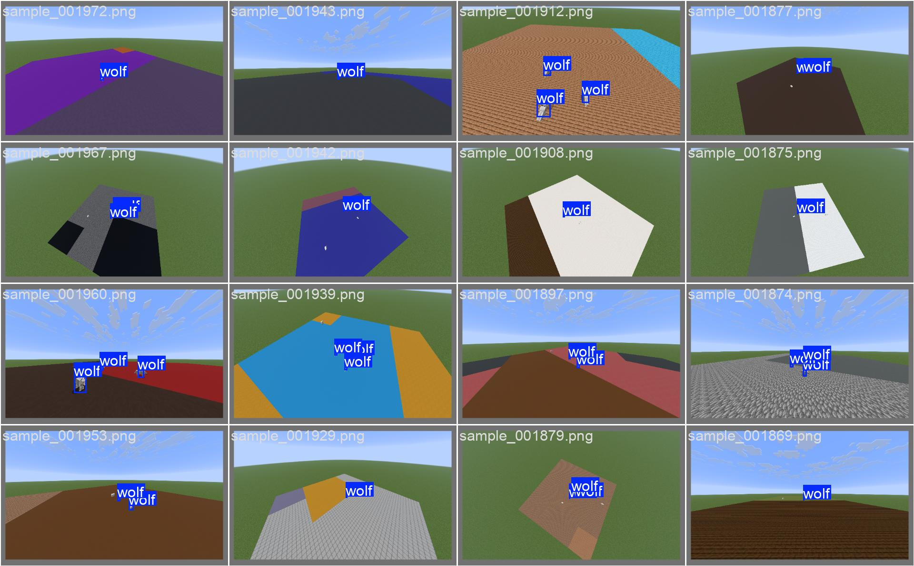
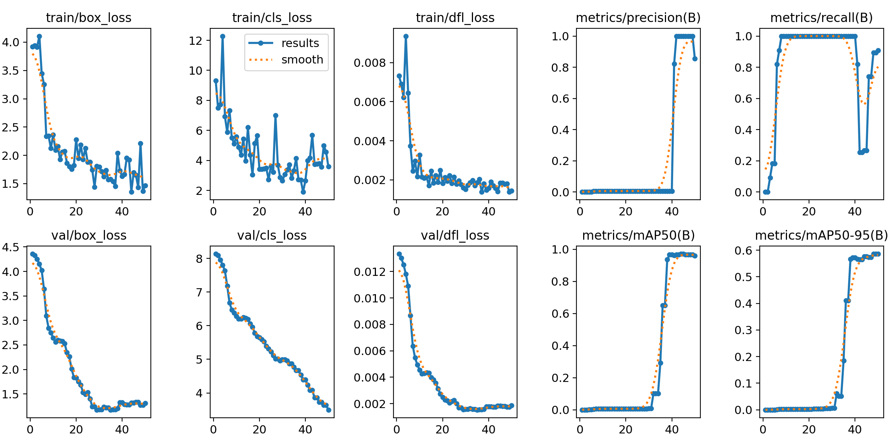
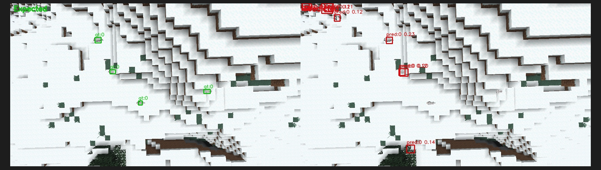
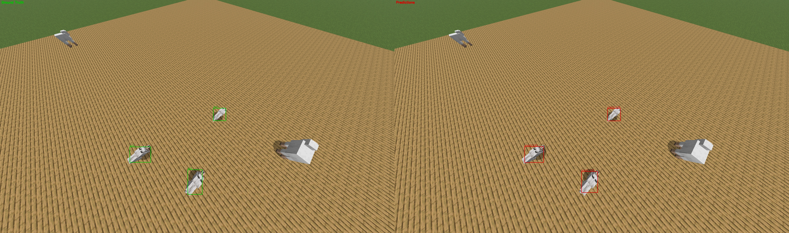

# Final Video

<video width="100%" controls>
  <source src="./img/vid.mp4" type="video/mp4">
</video>

  <strong>Leave space for live gameplay demo.</strong>

# Project Summary

Our project aims to build a real-time wolf detector for Minecraft that can run during gameplay. The input to the system
is an image frame captured from Minecraft, and the output is a set of 2D bounding boxes with confidence scores
indicating where wolves appear in the frame.

A large part of the engineering was put into getting a reliable data pipeline to train our models with. We wrote a
NeoForged mod that spawns wolves, captures screenshots, and converts each wolf's in-game 3D hitbox into a YOLO-format 2D
annotation. That let us generate training data directly from Minecraft instead of labeling images by hand.

The biggest struggle we ran into was that good results were very dependent on the data quality and data diversity that
we gave it. Our early models looked promising in a simple setup, but struggled in a more complex environment. We used a
mostly fixed camera, a predictable floor, and no meaningful distractor mobs. In the final stage of the project, we made
the task harder in three targeted ways. We changed camera angles, changed the floor across ~100 multicolored Minecraft
block types, and added sheep to the scene so the detector had to ignore lookalike mobs.

# Approach

<figure style="text-align: center; margin: 1.25rem 0;">
  
  <figcaption style="color: #777; margin-top: 0.5rem;">Pipeline for Minecraft data generation, training, and evaluation</figcaption>
</figure>

## Minecraft Environment

We chose to generate our training data directly inside Minecraft so that the model would learn from the same visual
environment it would later run in. This helped ensure the wolf detector would work in the game across different terrains
and situations.

For the initial experiments, we used a simple superflat world and repeatedly generated scenes with wolves from a
birds-eye view. This made it easier to build and test the data pipeline before expanding to more varied environments.

## Data Generation

### Data Pipeline
Our data generation pipeline was built as a custom NeoForged mod. At runtime, the mod:

- Spawns wolves around a center point at randomized positions.
- Teleports the player around the center point so that the wolves are seen from different camera angles.
- Replaces the floor with one of 78 differently colored Minecraft blocks.
- Spawns sheep into the scene.
- Captures a screenshot from the players viewpoint.
- Reads each wolf's 3D axis-aligned bounding box from the game engine.
- Writes one YOLO annotation per visible wolf in the format `<class_id> <center_x> <center_y> <width> <height>`.
- Clear and reset the scene with the steps above

### Data Complexity

#### Adding Hard Negatives
The sheep were intentionally included but not labeled, since this remained a one-class wolf detector. That made them
useful hard negatives. If the detector started drawing wolf boxes around sheep, it meant the model was still relying on
visual cues such as whiteness instead of actually distinguishing wolf features.

#### Adding Background Variation
One small detail we kept in the dataset was the platform frequently appearing as two types of blocks instead of one.
This happens because when we replace a large amount of blocks, the game doesn't re-render them all right away. We chose
not to fix this bug since they added more variation of the environment to the dataset.

#### Handling Occlusion
To avoid labeling wolves that the player could not actually see, we added a visibility check using ray tracing from the
camera to the bounding-box corners. If the wolf was fully occluded by terrain or another mob, we excluded it from the
labels. This was less useful for our superflat scenario but would've been useful to correctly label occluded wolves in
the future.

### Data Generation Considerations
The different datasets ended up having a large impact on the behavior of the final model. Each step of variation that
was added forced the detector to rely less on simple shortcuts and more on the actual visual features of wolves. Each
change exposed new weaknesses in earlier models and helped us guess what the detector was really learning from the data.

We also considered generating training data in the Minecraft overworld so the model could learn from more natural
terrain and occlusion. However, we didn't have a way to reliably vary the enviroment. In our superflat environment, we
were able to control the color and angle of our samples consistently. Because of this, we chose to keep training data
generation in the controlled platform for now.

<figure style="text-align: center; margin: 1.25rem 0;">
  
  <figcaption style="color: #777; margin-top: 0.5rem;">Varied training samples generated in Minecraft.</figcaption>
</figure>

## AI Model

We generated our training data directly inside Minecraft so the model would learn from the same visual environment it
would later run in. This helped ensure the wolf detector would work across different terrains and situations in the
game.

For the initial experiments, we used a simple superflat world and repeatedly generated scenes with wolves from a
bird’s-eye view. This controlled setup made it easier to build and debug the data pipeline before expanding to more
varied environments.

For the detection model, we considered both training a custom convolutional neural network (CNN) and using an existing
object detection framework.

| Approach                              | Advantages                                                                       | Limitations                                                                    |
|---------------------------------------|----------------------------------------------------------------------------------|--------------------------------------------------------------------------------|
| Custom CNN                            | Full control over architecture, useful for experimentation                       | Requires implementing detection logic and bounding box prediction from scratch |
| [YOLO](https://docs.ultralytics.com/) | Fast inference, established object detection framework, simple training pipeline | Less architectural control compared to building a model from scratch
     |

\
Given the goal of real-time inference, we chose to use the YOLOv26 model with a
custom dataset because it was the most performant and had the most flexibility for our needs.

# Evaluation

We split the dataset into training and validation sets and trained directly on the auto-labeled screenshots. After
training, our evaluation script loaded the best checkpoint and compared predicted boxes with the ground truth using an
IoU threshold of 0.50. From this we computed the number of true positives, false positives, and false negatives.

In addition to these metrics, we also performed qualitative evaluation. We visually inspected predicted bounding boxes
against the ground truth (see preliminary model) and tested the detector during live gameplay to observe how it behaved
in real in-game situations and identify environments where the model struggled.

Evaluating the model both quantitatively and qualitatively helped us better understand its strengths and failure cases
while iterating on the dataset and training process.

## Preliminary Model

Our first meaningful model, `v1`, was trained on only 20 randomly generated superflat grass images. It achieved
`TP = 20510`, `FP = 3450`, and `FN = 2051`, corresponding to `85.60%` precision and `90.91%` recall.

During training, the model improved steadily. The loss curves dropped and the validation metrics increased. This
suggested it was learning how to do well in a superflat environment.

However, when we tested the model in the Minecraft overworld, its performance dropped sharply. Wolves in natural terrain
were often missed, and the model sometimes produced incorrect detections. This made it clear that the model had learned
patterns specific to the training setup rather than general visual features of wolves. These errors are especially
apparent on the snow environment as shown below.

From this version, we were able to guess most of the remaining challenges in the project: things such as camera framing,
floor appearance, or the lack of similar mobs.

<figure style="text-align: center; margin: 1.25rem 0;">
  
  <figcaption style="color: #222; margin-top: 0.5rem;">Training and validation curves for the preliminary YOLO model, including losses, precision, recall, and mAP.</figcaption>
</figure>

<figure style="text-align: center; margin: 1.25rem 0;">
  
  <figcaption style="color: #222; margin-top: 0.5rem;">Preliminary model failure in an overworld snow scene: expected wolf locations on the left, low-confidence and incorrect predictions on the right.</figcaption>
</figure>

## Iterating for Improvements

#### V1
After seeing how poorly our preliminary model (`v1`) performed in the overworld, we knew that there needed to be better training data. The early results already showed that the detector was overfitted to the training data, so most of our effort went into making the dataset larger and more varied.

  <table>
    <thead>
      <tr>
        <th>Model / Stage</th>
        <th>Training Set Size</th>
        <th>Precision</th>
        <th>Recall</th>
        <th>Takeaway</th>
      </tr>
    </thead>
    <tbody>
      <tr>
        <td>v1</td>
        <td><code>{20}</code> images</td>
        <td><code>{85.60%}</code></td>
        <td><code>{90.91%}</code></td>
        <td>Promising start, but still too many false positives and missed detections</td>
      </tr>
    </tbody>
  </table>

  

    
Downsides

    
The model overfit to a narrow superflat setup and failed to generalize to overworld terrain.

  

  

    
Fix

    
Increase data size and scene diversity so the detector learns wolf-specific features instead of background shortcuts.

  

#### V2
The first change was simply increasing the dataset size. We expanded the training set from 20 images to 180 images, which gave the model many more examples of wolves from a birds-eye superflat view. We also trained the model for 120 epochs to account for the larger dataset size. This marked `v2`.

#### V3
In `v3`, we added camera-angle variation by teleporting the player around the scene so wolves would appear from different viewpoints.

#### V4
In `v4`, we introduced background variation by replacing the floor with dozens of different colored blocks.

#### V5
In `v5`, we added sheep to the scene as distractors so the model had to distinguish wolves from another similar-looking mob.

#### V6
In `v6`, we were happy with our variations and simply trained it with more data for more epochs.

These iterations made it clear that huge improvements came from the dataset. As we added variation, the model was forced to rely less on easy cues like a uniform background or a white blob. Designing data that pushed the model toward the correct visual features was the most challenging part of the project.

{INSERT TABLE HERE}

## Final Model

We tested `v6` after removing several simplifying assumptions from the earlier setup. The earlier models showed that the pipeline could detect wolves in a narrow setting, but `v6` tests whether the detector still works once camera angle, floor appearance, and distractor mobs are allowed to vary.

`v6` represents the stage of the project where the evaluation setup more closely resembles real gameplay conditions. 

{final model graphs}

{final model live overworld image}

# Resources Used

- Ultralytics YOLO documentation for model training and inference: https://docs.ultralytics.com
- NeoForged for Minecraft mod development and in-game data generation: https://neoforged.net
- OpenCV (`cv2`) for image processing and drawing evaluation outputs: https://opencv.org
- Minecraft as the environment for data generation and testing: https://www.minecraft.net
- ChatGPT for code clarification and minor implementation support; the system design, project decisions, and main
  implementation work were completed by the team
